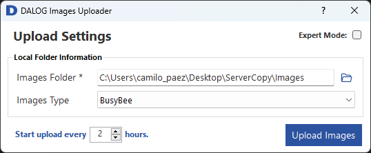

# DALOG Image Uploader

A graphical client to upload DALOG Data Images of any kind from a local folder to the DALOG Data Platform.

## Table of Contents

-   [Download and Installation](#Download-and-Installation)
-   [Usage](#Usage)
    -   [Login](#Login)
    -   [Basic Mode](#Basic-Mode)
    -   [Expert Mode](#Expert-Mode)
-   [License](#MIT-License)

# Download and Installation

The latest version can be downloaded from the repository's <a href="https://github.com/DALOG-Diagnosesysteme-GmbH/ddp-image-uploader/releases" target="_blank">GitHub releases section</a>. The instructions for its installation are described below:

1. Download the latest _Dalog.DataPlatform.Client.ImageUploader_Setup.exe_ installation file in your machine and double click on it. You will need Administrator rights to execute it. The installation wizard will start.
2. Select the installation path and click on _Next_.

    
      

3. Select the application's shortcuts folder and click on _Next_.

    
      

4. Click on _Install_. The executable will start installing the application and all its dependencies.

    
      

5. When the installation process is done, the following dialog will be displayed:

    
      

Finally, click on _Finish_ to close the installation wizard. Depending on your selection in the _Launch DALOG Image Uploader_ dialog, the DALOG Image Uploader will start.

# Usage

DALOG Image Uploader will allow users which have a DALOG Data Platform account, as well as corresponding permissions to upload images. This application has two modes: Basic and Expert mode. All settings configured will be saved and loaded when you run the application again.

## Login

-   Double click on the Dalog.DataPlatform.Client.ImageUploader application file.
-   Login with your account.

    
      

-   If the login is successful, you will be redirected to the main window. Otherwise, you will see the following dialog:

 

    
    

## Basic Mode

Before starting the DALOG Data images uploading process, the folder path where the images are stored, as well as the type of these images must be selected on the main window.

    
      

Then, click on the _Upload Images_ button. The Upload window will be shown and the results of each DALOG Data Image upload process will be seen on the table shown below. The values under the **Success** table column indicate whether a determined image was successfully uploaded or not:

    
      

If there was an error uploading a certain image, the error message will be displayed on the **Response Message** column. When the process is done, the following window will be displayed:

    
      

The DALOG Images Upload app starts the upload process automatically every two (2) hours by default. This value can be changed on the numeric up down element located at the lower left side of the main window.

    
      

      
After changing the value and pressing enter, you will receive a notification with information about the next date time an automatic upload process will occur.

    
      

When an automatic upload process has begun, the following notification will be displayed:

    
      

And when this process has finished, you will receive the following notification:

    
      

## Expert Mode

By clicking on the _Expert Mode_ checkbox in the upper right side of the main window, the following options will be displayed:

    
      

For advance network settings (SSL checks. Proxy connection details) click on the _Network settings_ button. You will be redirected to the window shown below, where you can select whether to disable the SSL check, and the use and proxy and its login access details.

    
      

If these settings are not correctly configured, a dialog will be displayed with the errors to solve. Otherwise you will be redirected to the main window.

    
      

To test whether your settings will allow you to upload images to the DALOG Data Platform you can click on the _Test connection_ button. The test connection results will be shown after the ping test.

    
      

      
To reset the settings to their default values, click on the _Reset settings_ button. The confirmation dialog shown below will be prompted

    
      

After clicking on the _Confirm_ button, all basic and network settings will be returned to their default values as shown below.

    
      
 
      
# MIT License

Copyright (c) 2023 DALOG Diagnosesysteme GmbH

Permission is hereby granted, free of charge, to any person obtaining a copy
of this software and associated documentation files (the "Software"), to deal
in the Software without restriction, including without limitation the rights
to use, copy, modify, merge, publish, distribute, sublicense, and/or sell
copies of the Software, and to permit persons to whom the Software is
furnished to do so, subject to the following conditions:

The above copyright notice and this permission notice shall be included in all
copies or substantial portions of the Software.

THE SOFTWARE IS PROVIDED "AS IS", WITHOUT WARRANTY OF ANY KIND, EXPRESS OR
IMPLIED, INCLUDING BUT NOT LIMITED TO THE WARRANTIES OF MERCHANTABILITY,
FITNESS FOR A PARTICULAR PURPOSE AND NONINFRINGEMENT. IN NO EVENT SHALL THE
AUTHORS OR COPYRIGHT HOLDERS BE LIABLE FOR ANY CLAIM, DAMAGES OR OTHER
LIABILITY, WHETHER IN AN ACTION OF CONTRACT, TORT OR OTHERWISE, ARISING FROM,
OUT OF OR IN CONNECTION WITH THE SOFTWARE OR THE USE OR OTHER DEALINGS IN THE
SOFTWARE.
